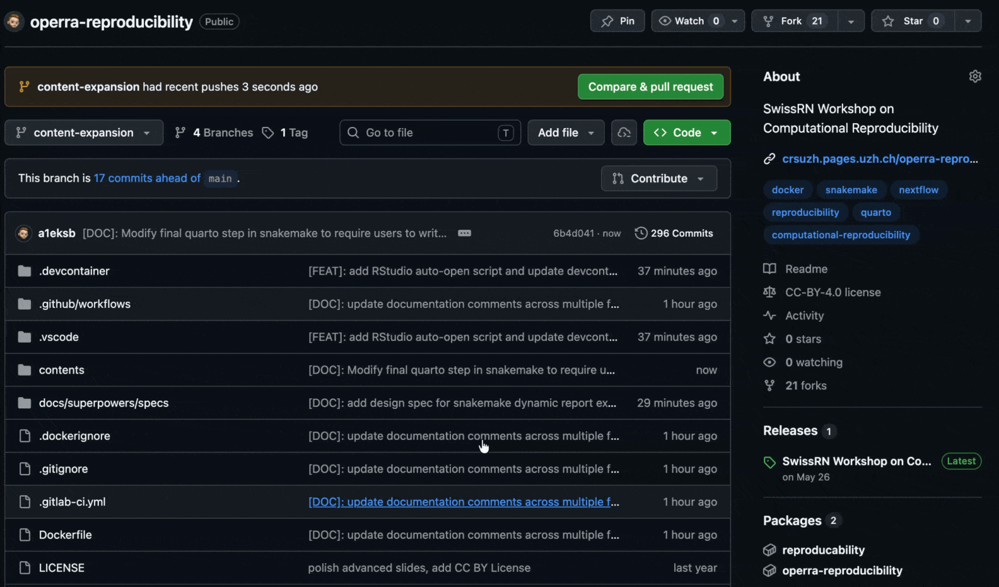
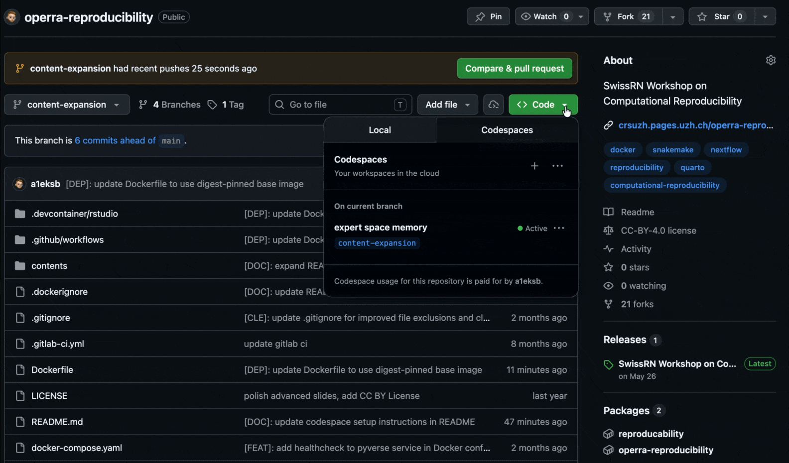

Make sure your computer meets the requirements of at least one of the following options prior to the workshop. Option 1 is the simplest and our recommended setup.

## Option 1: GitHub Codespaces (recommended)

Requirements:

- A personal [GitHub](https://github.com) account

With this option, you will work in a GitHub codespace.

- Fork this repository to your account: <https://github.com/a1eksb/operra-reproducibility>

- Create a new codespace.
  1. Code (green button) > Codespaces
  2. Create codespace (this may take several minutes)

    

- You will be notified in the bottom-right corner that this workspace has tasks defined that can launch processes automatically. Click **Allow** to open the RStudio instance in a new tab.
- Alternatively navigate to `Ports` and open the provided URL in a new tab

- After the workshop, when you are finished, stop or delete the codespace so it does not keep consuming your free monthly quota.
  1. Open `Code` → `Codespaces`
  2. Use the `...` menu next to your codespace:
  3. **Stop** keeps your work for later, while
  4. **Delete** removes the codespace and any uncommitted changes in it.

    

## Option 2: Work locally with Docker compose

Requirements:

- [Git](https://git-scm.com/install/) installed
- [Docker](https://docs.docker.com/get-docker/) and [Docker Compose](https://docs.docker.com/compose/install/) installed

Further instructions are provided here: <https://github.com/a1eksb/operra-reproducibility>

## Option 3: Work locally "by hand"

Requirements:

- [Git](https://git-scm.com/install/) installed
- [R](https://cran.r-project.org/) installed, including the `dplyr`, `ggplot2`, and `kableExtra` packages
- [Python 3](https://www.python.org/downloads/) installed, including the packages in `requirements.txt`
- [Java 21](https://adoptium.net/) installed if you use Nextflow
- [Graphviz](https://graphviz.org/download/) installed
- [RStudio](https://posit.co/download/rstudio-desktop) or [Visual Studio Code](https://code.visualstudio.com/) installed
- [Quarto](https://quarto.org/) installed
- A [make utility](https://www.gnu.org/software/make/) and [snakemake](https://snakemake.readthedocs.io/en/stable/getting_started/installation.html) or [nextflow](https://docs.seqera.io/nextflow/install) installed 
