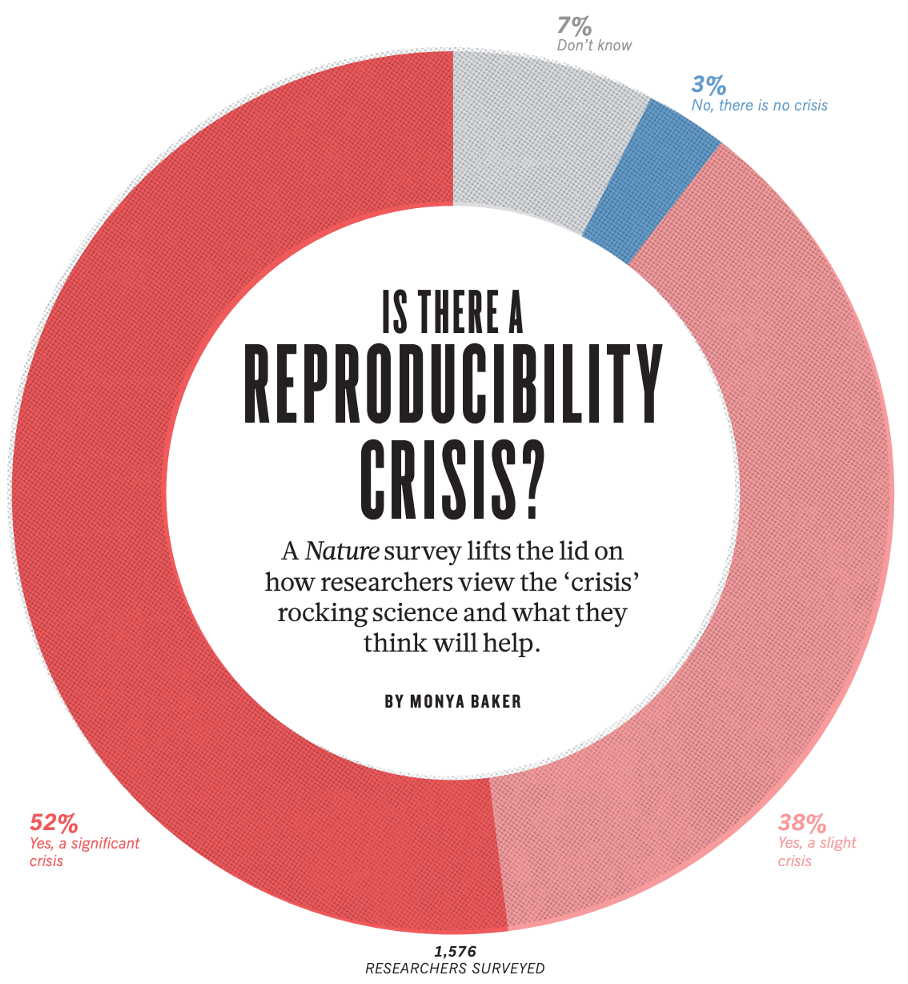
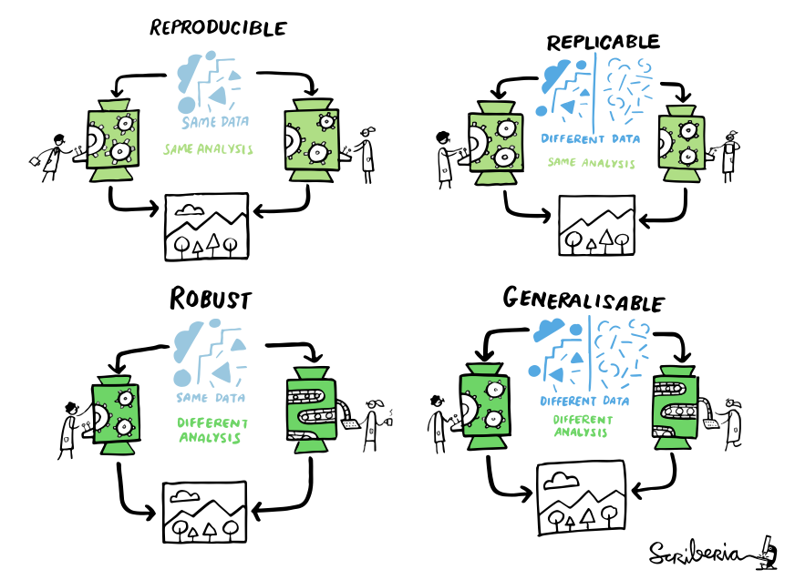
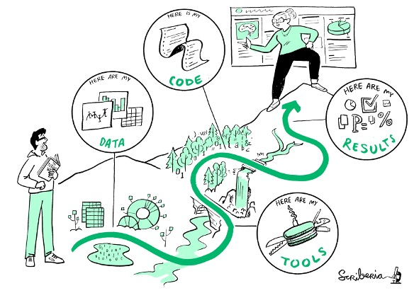
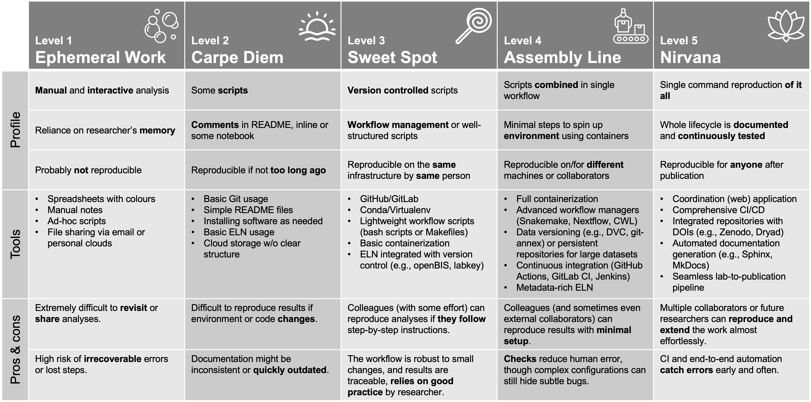
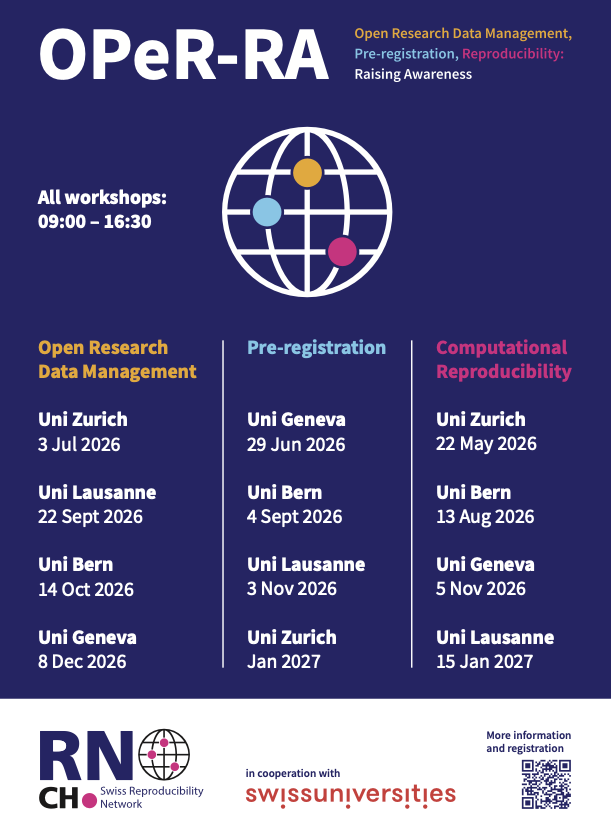

## Computational reproducibility

A (too) simple definition:

[The **same analysis**]{.fragment} [of the **same data**]{.fragment} [produces the **same results**]{.fragment}

\

::: fragment
{fig-align="center" width="50%"}
:::
------------------------------------------------------------------------

## Example 1

{fig-align="center" width="70%"}

::: incremental
-   Attempted to rerun [22,578 Python notebooks]{.mark} from 3,467 PubMed publications 
-   15,817/22,578 = 70%: Declared software dependencies
-   10,388/15,817 = 66%: Dependencies could be installed
-   1,203/10,388 = 12%: Ran through without any errors
-   [879/10,388 = 8%]{.mark}: Produced results identical to those reported in the original
:::

------------------------------------------------------------------------

## Example 2

{fig-align="center" width="70%"}

::: incremental
-   Attempted to rerun **9,000 R files** associated with 2,000 data sets in Harvard Dataverse
-   44% ran through without error when when code cleaning was applied
-   **26% ran through without error**
:::

::: fragment
$\rightarrow$ **Still optimistic estimates: code from non-sharing authors is likely less reproducible**
:::

::: fragment
$\rightarrow$ **Computational reproducibility can be challenging in practice!**
:::

------------------------------------------------------------------------

## Is this a recent issue?

{fig-align="center" width="50%"}

::: fragment
10 years ago, 90% of interviewed research thought there was an issue...
:::

::: fragment
...that's when Brexit happened!
:::

------------------------------------------------------------------------

## Context and terminology

{fig-align="center" width="75%"}

------------------------------------------------------------------------

## The four horsemen of irreproducibility

{fig-align="center" width="100%"}

<table>
  <tr>
    <td class="fragment">Publication bias</td>
    <td class="fragment">Low power</td>
    <td class="fragment">p-value hacking</td>
    <td class="fragment">HARKing</td>
  </tr>
</table>

------------------------------------------------------------------------

## Computational reproducibility

{.absolute right="0" top="0" height="75"}

------------------------------------------------------------------------

## Write everything down?

{fig-align="center" width="75%"}

------------------------------------------------------------------------

## Replicability: Example

{.absolute right="0" top="0" height="75"}

{fig-align="center" width="640"}

------------------------------------------------------------------------

## Robustness: Example

{.absolute right="0" top="0" height="75"}

::::: {.columns align="center"}
::: {.column width="50%"}

:::

::: {.column width="50%"}
{height="400"}
:::
:::::

------------------------------------------------------------------------

## Generalizability

{.absolute right="0" top="0" height="75"}

 

{fig-align="center" width="50%"}

::: fragment
$\rightarrow$ **Reproducibility + Robustness + Replicability necessary for Generalizabilty!**
:::

------------------------------------------------------------------------

## Every step counts

:::::::::::: {.columns align="center"}
:::::: fragment
::::: {.columns align="center"}
::: {.column width="72%"}
Reproducible research is difficult.
:::

::: {.column width="28%"}

:::
:::::
::::::

::::::: fragment
:::::: {.columns align="center"}
:::: {.column width="60%"}
Do not despair. With every step...

::: incremental
-   you are already **one step ahead**
-   you **already improve** the quality of your research   (and of your life)
-   you learn **broadly applicable technical skills**
:::
::::

::: {.column width="40%"}
{fig-align="center" width="100%"}
:::
::::::
:::::::
::::::::::::

------------------------------------------------------------------------

## Trying to self assess

{fig-align="center" width="100%"}

------------------------------------------------------------------------

## ...once more!

{fig-align="center" width="75%"}

------------------------------------------------------------------------

## The SwissRN OPeR-RA workshops

{fig-align="center" height="550"}

------------------------------------------------------------------------

## The Swiss Reproducibility Network

::::: columns
::: {.column width="80%"}
-  SwissRN is a **peer-led consortium** that promotes rigorous research practices in Switzerland

-  Organised in **local nodes** at Swiss research institutions

-  To get started, join the [mailing list](https://ebpi.lists.uzh.ch/sympa/subscribe/swissrn?previous_action=review)

-  For early-career researchers, consider joining the [SwissRN Academy](https://www.swissrn.org/contents/academy/) 
:::

::: {.column width="20%"}

:::
:::::

------------------------------------------------------------------------

## The Center for Reproducible Science and Research Synthesis

::::: {.columns align="center"}
::: {.column width="50%"}
{height="250"}

<https://www.crs.uzh.ch>

:::

::: {.column width="50%" align="top"}
**Teaching and training**

-   Good Research Practice courses\
-   Educational resources, e.g., [Primers](https://www.crs.uzh.ch/en/resources/CRS-Primers.html)\
-   [ReproducibiliTea](https://www.crs.uzh.ch/en/training/ReproducibiliTea.html) journal club

**Research**

-   Evidence synthesis in biomedical research
-   Open research data
-   Methods for replication studies
-   Assessing and improving research  quality
:::
:::::

------------------------------------------------------------------------

## NEXUS Personalized Health

::::: {.columns align="center"}
::: {.column width="50%"}
{width="100%"}

<https://www.nexus.ethz.ch>

:::

::: {.column width="50%" align="top"}
**Technology Platform**

-   Research services in **biomedical research and development**
-   Open to all researchers, also in industry
-   Fee-for-service model ([pricing](https://www.nexus.ethz.ch/working-with-us/pricing.html))

**Groups**

-   Clinical Bioinformatics
-   Biostatistics
-   Software Engineering
-   Screening & Lab Automation
-   Systems Operations

:::
:::::

------------------------------------------------------------------------

## Structure of this workshop

1.  **Introduction** -- what is computational reproducibility?

2.  **Version control**

3.  **Dynamic reporting**

4.  **Workflow management**

5.  **Software containers**

3.  **Sharing and publishing** -- How to share it with others?

::: fragment
Website with all materials: <https://a1eksb.github.io/operra-reproducibility/>
:::

------------------------------------------------------------------------
