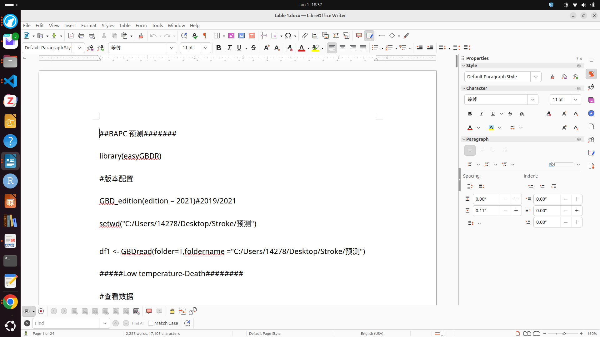

## FAIR sharing

{fig-align="center" width=60%}

::: aside
The Turing Way project illustration by Scriberia. Used under a CC-BY 4.0 licence. DOI: [The Turing Way Community & Scriberia (2024)](https://doi.org/10.5281/ZENODO.3332807).
:::

------------------------------------------------------------------------

## FAIR: Findable

Sometimes a paper links to GitHub for code but you find this:

::: fragment
**Solution:** Persistent identifiers (e.g., DOI) make code `findable` and `citable`.

#### Where can I get a DOI ?

-   Data repositories (e.g., Zenodo, Ebrains...)
-   Journals and preprint platforms
:::

------------------------------------------------------------------------

## FAIR: Accessible

- Meaningful access conditions
- Downloadable via common protocols (https, ftp, ssh)

------------------------------------------------------------------------

## FAIR: Interoperable

Use standard, non-prorietary file formats
 
 

| **Category** | **Recommended formats** |
|------------------------|------------------------------------|
| README files | Markdown (*MD*) or text (*TXT*) |
| Tabular data | *CSV* |
| Structured plain text | *XML*, *JSON* (e.g., metadata companion files) |
| Images | *PDF*, *JPEG*, *PNG*, *TIFF*, *SVG* |
| Audio | *FLAC*, *AIFF*, *WAV*, *MP3*, *OGG* |
| Video | *AVI*, *MPEG*, *MP4* |
| Compressed file archives | *TAR.GZ*, *7Z*, *ZIP* |

------------------------------------------------------------------------

## FAIR: Reusable

::: {.incremental}
- Provide `data provenance` (history)
  - e.g. version control with Git
- Capture software `dependencies`
  - Software containers
  - Documentation (e.g. `sessionInfo()` in R)
- Add a `license`
  - e.g. MIT (permissive), GNU GPLv3 (copyleft), CC-BY (non-code)
  - [https://choosealicense.com/](https://choosealicense.com/)
:::

------------------------------------------------------------------------

## Caution: open science tokenism

{fig-align="center" width="75%"}

::: { .fragment .font-small}
A real example from a real paper: R code dumped in a .docx file and shared in the supplementary materials.

**Exercise:** Find 3 reasons why this fails to be FAIR
:::

------------------------------------------------------------------------

## The FAIR principles in action

After today's workshop, you have any of the following:

::: incremental
-  A `version-controlled repository` published on GitHub
-  A `dynamic report` conducting an analysis 
-  An `automated workflow` running the analysis
-  A `Dockerfile` capturing the software dependencies
:::

::: fragment
We still need **persistent identification**.
:::
------------------------------------------------------------------------

## Git repositories and DOIs

-   GitLab and GitHub do not offer DOIs
-   'Persistent URLs'/'Permanent links' not as strongly persistent
-   But we can combine a [GitHub releases](https://docs.github.com/en/repositories/releasing-projects-on-github/about-releases/) with a DOI enabling platform
-   A `release` in GitLab is a `snapshot` of a repository with
    -   Version tag
    -   Source code and metadata

------------------------------------------------------------------------

## Zenodo

-  [Zenodo](https://zenodo.org/) is a popular generalist DOI-enabling repository.
-   Free. 50 GB upload limit per dataset (up to 200Gb upon request).
-   Hosted by CERN. The data stays in Europe.

::: {.column width="60%"}
{ fig-align="left" .lightbox width="100%"}
:::

::: {.column .font-small width="40%"}
A citable Zenodo entry with a DOI and the content of the repository release in a .zip file.
:::

------------------------------------------------------------------------

### Checklist for publishing a git repository

::: incremental
-  Add description in README (dates, project ID, funding, affiliations, DOI )
-  Provide instructions how to reproduce the analysis
-  Create a release lock the version of a repository
-  Rather than cite the URL, assign a DOI to the release, e.g. with a Zenodo upload
-  Add a license file to explain reusability (use a template)
-  If applicable, add the DOI of the publication in the description
-  Indicate where the source data can be found
:::

------------------------------------------------------------------------

## Conclusions

-   Dynamic reporting + version control + automation + containerization

    -   improve **reproducibility**, **reusability**, **collaboration**
    -   lends research more **transparency**, **credibility**

. . .

-   There is a **learning curve**, but ...

    -   start simple and learn **step-by-step** 

    -   **select parts** of the workflow you find intuitive 

    -   invested learning time can **save you time** in the future 

    -   skills are **useful in- and outside academia**

------------------------------------------------------------------------

## The SwissRN OPeR-RA workshops

{fig-align="center" height="550"}

------------------------------------------------------------------------

## The Swiss Reproducibility Network

::::: columns
::: {.column width="80%"}
-  SwissRN is a **peer-led consortium** that promotes rigorous research practices in Switzerland

-  Organised in **local nodes** at Swiss research institutions

-  To get started, join the [mailing list](https://ebpi.lists.uzh.ch/sympa/subscribe/swissrn?previous_action=review)

-  For early-career researchers, consider joining the [SwissRN Academy](https://www.swissrn.org/contents/academy/) 
:::

::: {.column width="20%"}

:::
:::::